# InpaintingMamba: A State Space Model for Image Inpainting

# 📊 Code

The code will be released after acceptance.

---

# 📊 Experimental Results

This document presents a comparison of our method with other approaches on the CelebA-HQ and Places2 datasets, as well as additional visual results.

---

## 📁 Comparisons to SOTAs

<table>
  <tr>
    <th>Input</th>
    <th>LaMa</th>
    <th>Wavefill</th>
    <th>W-Net</th>
    <th>CMT</th>
    <th>HINT</th>
    <th>Ours</th>
    <th>Ground Truth</th>
  </tr>

[//]: # (1)
  <tr>
    <td><figure>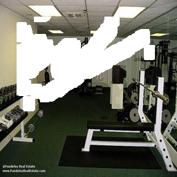</figure></td>
    <td><figure>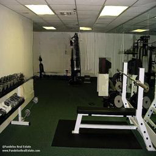</figure></td>
    <td><figure>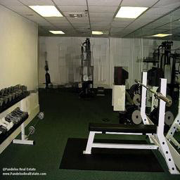</figure></td>
    <td><figure>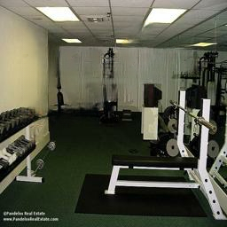</figure></td>
    <td><figure>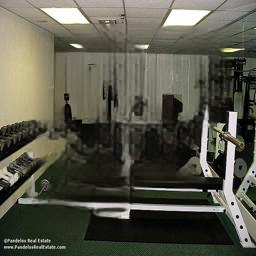</figure></td>
    <td><figure>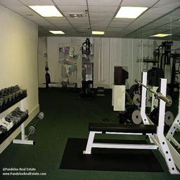</figure></td>
    <td><figure>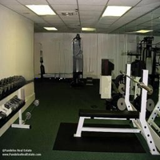</figure></td>
    <td><figure>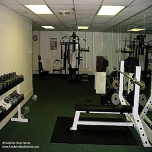</figure></td>
  </tr>

[//]: # (2)
  <tr>
    <td><figure>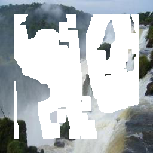</figure></td>
    <td><figure></figure></td>
    <td><figure></figure></td>
    <td><figure></figure></td>
    <td><figure></figure></td>
    <td><figure></figure></td>
    <td><figure></figure></td>
    <td><figure></figure></td>
  </tr>

[//]: # (8)
  <tr>
    <td><figure></figure></td>
    <td><figure></figure></td>
    <td><figure></figure></td>
    <td><figure></figure></td>
    <td><figure></figure></td>
    <td><figure></figure></td>
    <td><figure></figure></td>
    <td><figure></figure></td>
  </tr>

[//]: # (9)
  <tr>
    <td><figure>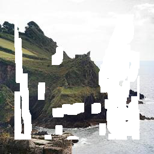</figure></td>
    <td><figure></figure></td>
    <td><figure></figure></td>
    <td><figure></figure></td>
    <td><figure></figure></td>
    <td><figure></figure></td>
    <td><figure></figure></td>
    <td><figure></figure></td>
  </tr>

[//]: # (10)
  <tr>
    <td><figure></figure></td>
    <td><figure></figure></td>
    <td><figure>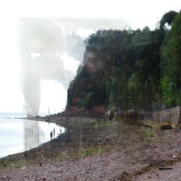</figure></td>
    <td><figure></figure></td>
    <td><figure></figure></td>
    <td><figure></figure></td>
    <td><figure></figure></td>
    <td><figure></figure></td>
  </tr>

[//]: # (3)
  <tr>
    <td><figure>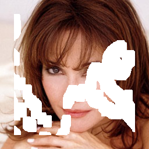</figure></td>
    <td><figure></figure></td>
    <td><figure></figure></td>
    <td><figure></figure></td>
    <td><figure></figure></td>
    <td><figure></figure></td>
    <td><figure></figure></td>
    <td><figure></figure></td>
  </tr>

[//]: # (4)
  <tr>
    <td><figure>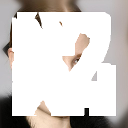</figure></td>
    <td><figure></figure></td>
    <td><figure>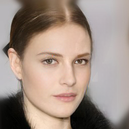</figure></td>
    <td><figure></figure></td>
    <td><figure></figure></td>
    <td><figure></figure></td>
    <td><figure></figure></td>
    <td><figure>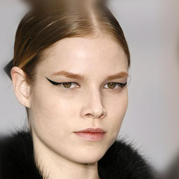</figure></td>
  </tr>

[//]: # (5)
  <tr>
    <td><figure>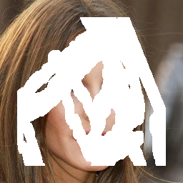</figure></td>
    <td><figure></figure></td>
    <td><figure></figure></td>
    <td><figure></figure></td>
    <td><figure></figure></td>
    <td><figure></figure></td>
    <td><figure></figure></td>
    <td><figure></figure></td>
  </tr>

[//]: # (6)
  <tr>
    <td><figure>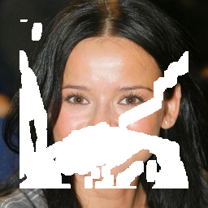</figure></td>
    <td><figure>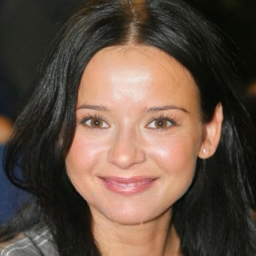</figure></td>
    <td><figure></figure></td>
    <td><figure>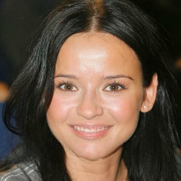</figure></td>
    <td><figure>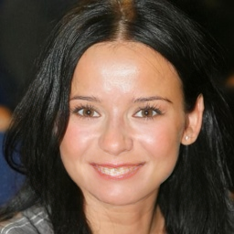</figure></td>
    <td><figure>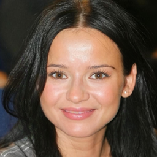</figure></td>
    <td><figure></figure></td>
    <td><figure></figure></td>
  </tr>

[//]: # (7)
  <tr>
    <td><figure>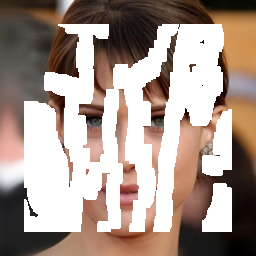</figure></td>
    <td><figure></figure></td>
    <td><figure></figure></td>
    <td><figure></figure></td>
    <td><figure>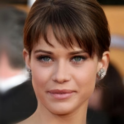</figure></td>
    <td><figure></figure></td>
    <td><figure></figure></td>
    <td><figure></figure></td>
  </tr>
</table>

## 📁 More Visual Results on Places2 Dataset
<table>
  <tr>
    <th>Input</th>
    <th>Ours</th>
    <th>Ground Truth</th>
    <th>Input</th>
    <th>Ours</th>
    <th>Ground Truth</th>
  </tr>

[//]: # (1)
  <tr>
    <td><figure></figure></td>
    <td><figure></figure></td>
    <td><figure></figure></td>
    <td><figure></figure></td>
    <td><figure></figure></td>
    <td><figure></figure></td>
  </tr>

[//]: # (2)
  <tr>
    <td><figure>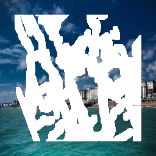</figure></td>
    <td><figure>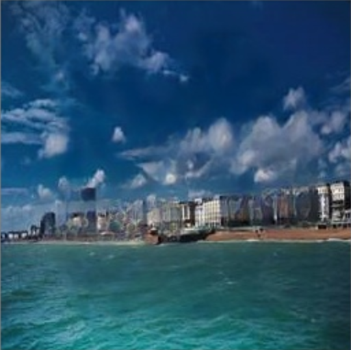</figure></td>
    <td><figure></figure></td>
    <td><figure>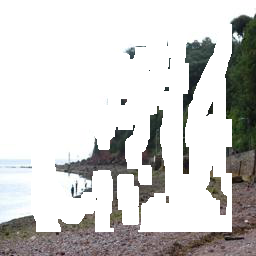</figure></td>
    <td><figure></figure></td>
    <td><figure></figure></td>
  </tr>

[//]: # (3)
  <tr>
    <td><figure>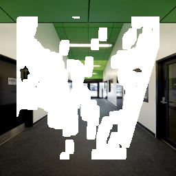</figure></td>
    <td><figure></figure></td>
    <td><figure></figure></td>
    <td><figure>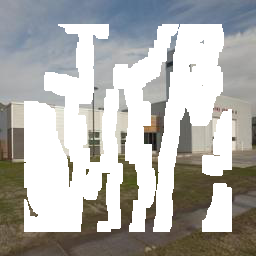</figure></td>
    <td><figure></figure></td>
    <td><figure></figure></td>
  </tr>

[//]: # (4)
  <tr>
    <td><figure>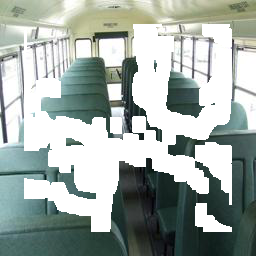</figure></td>
    <td><figure></figure></td>
    <td><figure></figure></td>
    <td><figure>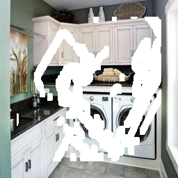</figure></td>
    <td><figure>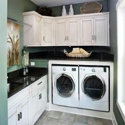</figure></td>
    <td><figure></figure></td>
  </tr>

[//]: # (5)
  <tr>
    <td><figure>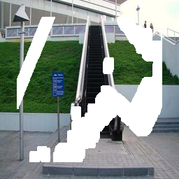</figure></td>
    <td><figure></figure></td>
    <td><figure></figure></td>
    <td><figure></figure></td>
    <td><figure>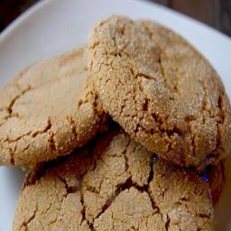</figure></td>
    <td><figure>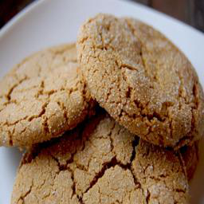</figure></td>
  </tr>

[//]: # (6)
  <tr>
    <td><figure>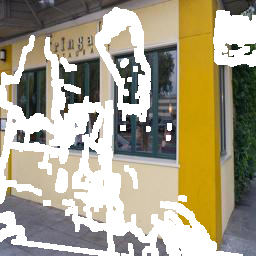</figure></td>
    <td><figure></figure></td>
    <td><figure></figure></td>
    <td><figure>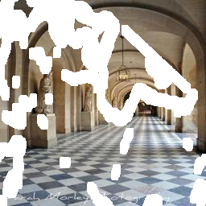</figure></td>
    <td><figure></figure></td>
    <td><figure></figure></td>
  </tr>

[//]: # (7)
  <tr>
    <td><figure>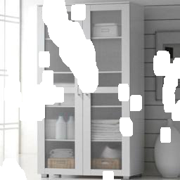</figure></td>
    <td><figure>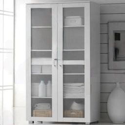</figure></td>
    <td><figure>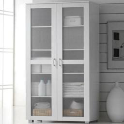</figure></td>
    <td><figure></figure></td>
    <td><figure></figure></td>
    <td><figure></figure></td>
  </tr>

[//]: # (8)
  <tr>
    <td><figure>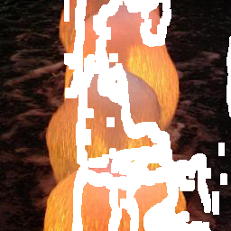</figure></td>
    <td><figure>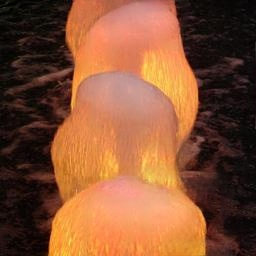</figure></td>
    <td><figure></figure></td>
    <td><figure>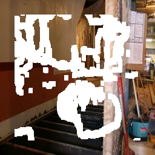</figure></td>
    <td><figure></figure></td>
    <td><figure>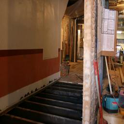</figure></td>
  </tr>
</table>

---

## 📁 More Visual Results on CelebA-HQ Dataset
<table>
  <tr>
    <th>Input</th>
    <th>Ours</th>
    <th>Ground Truth</th>
    <th>Input</th>
    <th>Ours</th>
    <th>Ground Truth</th>
  </tr>

[//]: # (1)
  <tr>
    <td><figure>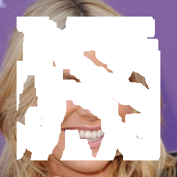</figure></td>
    <td><figure>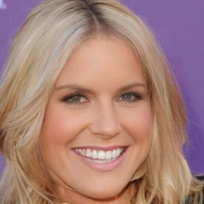</figure></td>
    <td><figure></figure></td>
    <td><figure>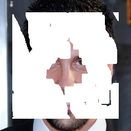</figure></td>
    <td><figure></figure></td>
    <td><figure></figure></td>
  </tr>

[//]: # (2)
  <tr>
    <td><figure>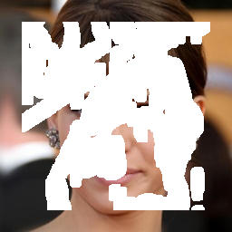</figure></td>
    <td><figure></figure></td>
    <td><figure></figure></td>
    <td><figure>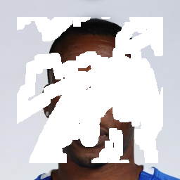</figure></td>
    <td><figure></figure></td>
    <td><figure></figure></td>
  </tr>

[//]: # (3)
  <tr>
    <td><figure>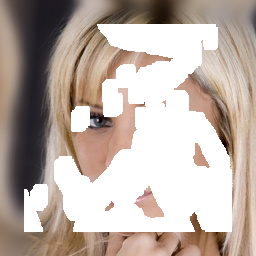</figure></td>
    <td><figure></figure></td>
    <td><figure></figure></td>
    <td><figure></figure></td>
    <td><figure></figure></td>
    <td><figure></figure></td>
  </tr>

[//]: # (4)
  <tr>
    <td><figure>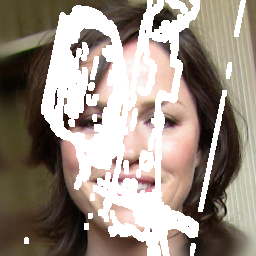</figure></td>
    <td><figure></figure></td>
    <td><figure></figure></td>
    <td><figure></figure></td>
    <td><figure></figure></td>
    <td><figure></figure></td>
  </tr>

[//]: # (5)
  <tr>
    <td><figure></figure></td>
    <td><figure></figure></td>
    <td><figure></figure></td>
    <td><figure></figure></td>
    <td><figure></figure></td>
    <td><figure></figure></td>
  </tr>

[//]: # (6)
  <tr>
    <td><figure></figure></td>
    <td><figure></figure></td>
    <td><figure></figure></td>
    <td><figure></figure></td>
    <td><figure></figure></td>
    <td><figure></figure></td>
  </tr>

[//]: # (7)
  <tr>
    <td><figure></figure></td>
    <td><figure></figure></td>
    <td><figure></figure></td>
    <td><figure></figure></td>
    <td><figure></figure></td>
    <td><figure></figure></td>
  </tr>

[//]: # (8)
  <tr>
    <td><figure></figure></td>
    <td><figure></figure></td>
    <td><figure></figure></td>
    <td><figure></figure></td>
    <td><figure></figure></td>
    <td><figure></figure></td>
  </tr>
</table>